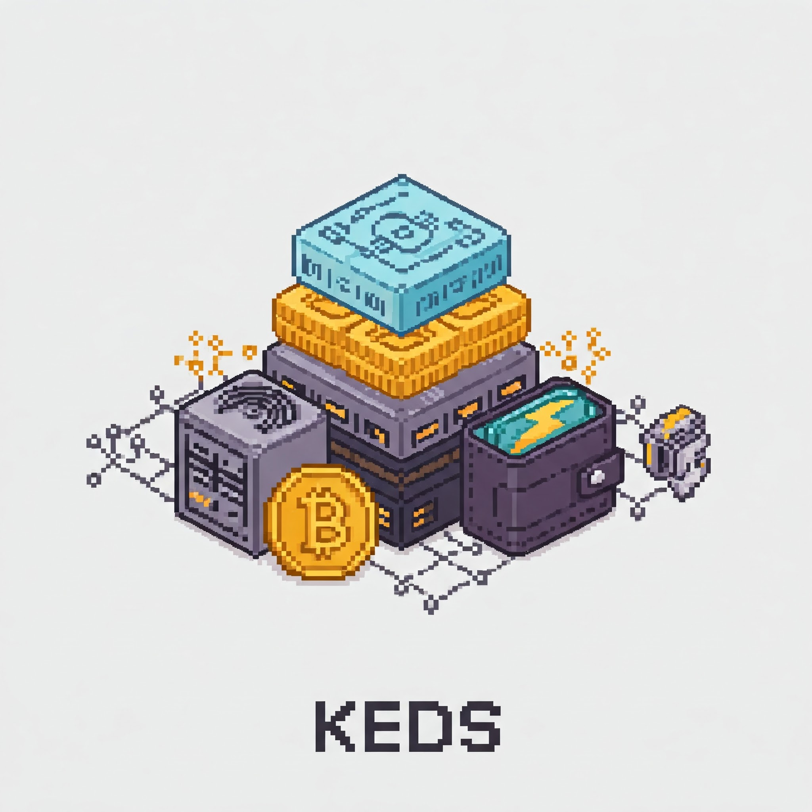

<p align="center">
  
</p>

# Knots Electrs Datum Specter/Sparrow (KEDS)

KEDS is a cohesive stack of Bitcoin infrastructure components. It bundles essential services (Knots, Electrs, DATUM, and a choice of Specter or Sparrow Wallet) for interacting with the Bitcoin network, serving wallet requests, and enabling efficient solo mining.

## Why KEDS?

*   **Integrated Solution:** Provides a pre-configured set of compatible components, simplifying the setup of essential Bitcoin infrastructure.
*   **Performance & Efficiency:** Leverages Bitcoin Knots for its optimizations and Electrs for efficient wallet queries. Includes DATUM for optimized solo mining block template creation.
*   **Wallet Choice:** Integrates with popular desktop wallets like Specter and Sparrow for user-friendly transaction and hardware wallet management.
*   **Enhanced Security:** All components are built from source code rather than using pre-built binaries, eliminating the risk of compromised or tampered distributions.

## Components

KEDS is composed of the following key components:

*   **[Bitcoin Knots](https://bitcoinknots.org/)**: A full node implementation of the Bitcoin protocol. It is based on Bitcoin Core but includes various enhancements and features aimed at improving performance and robustness. Knots handles the core blockchain data synchronization and validation.

*   **[Electrs (Electrum Rust Server)](https://github.com/romanz/electrs)**: An efficient implementation of the Electrum Server protocol. Electrs indexes the Bitcoin blockchain maintained by Knots, allowing Electrum-compatible wallets to quickly query blockchain information (addresses, transactions, balances) without needing a full node themselves.

*   **[DATUM Gateway](https://github.com/datum-project/datum)**: The DATUM Gateway implements lightweight, efficient, client-side decentralized block template creation. This allows for true solo mining by constructing block templates directly, reducing reliance on traditional mining pool infrastructure for this task.

*   **[CPUMiner](https://github.com/pooler/cpuminer)**: A simple CPU-based Bitcoin miner included to help operators test and verify that the mining setup is working correctly without requiring specialized ASIC hardware.

*   **Wallet Interface (Specter/Sparrow)**: Provides a user-friendly graphical interface for managing Bitcoin funds, transactions, and hardware wallets. KEDS includes Specter Desktop by default, but can be easily configured to work with Sparrow Wallet.
    *   **[Specter Desktop](https://specter.solutions/)**: Included in the default `docker-compose.yaml`. Focuses on hardware wallet interaction and multisignature setups.
    *   **[Sparrow Wallet](https://sparrowwallet.com/)**: An alternative desktop wallet focusing on transaction control, privacy, and hardware wallet support. Requires manual configuration to connect to the KEDS Electrs instance.

## Prerequisites

Before deploying KEDS, ensure you have the following:

*   Docker installed.
*   Sufficient disk space for the Bitcoin blockchain (~800GB+).
*   Adequate CPU and RAM resources (vary depending on usage, but recommend at least 4GB RAM and 2+ CPU cores).

## Configuration

KEDS uses a `.env` file in the project root directory to manage configuration settings like RPC credentials and pool addresses. This keeps sensitive information out of the main `docker-compose.yaml` file.

1.  **Create the `.env` file:**
    Create a file named `.env` in the same directory as the `docker-compose.yaml` file.

2.  **Add Configuration Variables:**
    Add the following variables to your `.env` file, replacing the example values with your desired settings:

    ```env
    # Bitcoin RPC Credentials used by Knots, Electrs, etc.
    RPC_USER=rpcuser
    RPC_PASSWORD=rpcpassword

    # Pool Address used by DATUM and CPUMiner
    POOL_ADDRESS=bc1q676lj6ttgpu7p25uk3ex2thyxdrvralct2upl4

    # Optional Coinbase Tag for DATUM
    COINBASE_TAG_SECONDARY="Cosmic Rocks"
    ```

    **Important:** If your `COINBASE_TAG_SECONDARY` contains spaces, enclose it in double quotes as shown.

3.  **(Optional but Recommended) Add `.env` to `.gitignore**:
    To prevent accidentally committing your credentials or custom settings to version control, add `.env` to your `.gitignore` file.

## Quick Start / Installation

KEDS builds all components from source code during the installation process, providing a security advantage over using pre-built binaries that could potentially be compromised.

1.  **Configure KEDS:** Create and populate the `.env` file as described in the [Configuration](#configuration) section above.
2.  **Start the Stack:** Run the following command to build the images (if necessary) and start the containers in detached mode:

    ```bash
    docker compose up -d
    ```

    The initial build process, especially for Bitcoin Knots, can take a significant amount of time depending on your system's performance. Subsequent starts will be much faster.

3.  **Monitor Logs (Optional):** You can view the logs for all services using:
    ```bash
    docker compose logs -f
    ```
    Or for a specific service (e.g., `knots`):
    ```bash
    docker compose logs -f knots
    ```

## Connecting Wallets

### Specter Desktop

Specter is included by default. Access it via `http://localhost:25441`. It should automatically detect the running Knots instance.

### Sparrow Wallet

1.  Download and install [Sparrow Wallet](https://sparrowwallet.com/).
2.  Go to `Preferences` -> `Server`.
3.  Select `Private Electrum` as the server type.
4.  Enter `localhost` for the URL and `50001` for the Port.
5.  Click `Test Connection`. It should connect successfully to the Electrs instance running within KEDS.

## Stopping KEDS

To stop the KEDS stack (containers and networks):

```bash
docker compose down
```

This command **does not** delete the data stored locally in the `./data` directory (blockchain data, wallet info, etc.), as KEDS uses bind mounts for persistence.

To stop the stack and remove anonymous volumes (if any were created, though typically not used by KEDS core services):

```bash
docker compose down -v
```

**To permanently delete all blockchain and wallet data:** You must manually delete the `./data` directory from your host machine after stopping the containers:

```bash
# First, stop the containers
docker compose down

# Then, remove the data directory (USE WITH EXTREME CAUTION!)
rm -rf ./data
```
